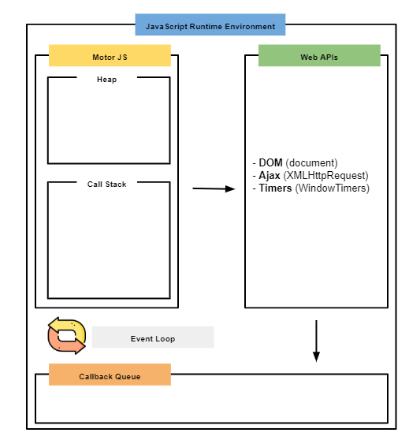

:::info Enlaces de utilidad
[Medium](https://mauriciogc.medium.com/javascript-c%C3%B3mo-funciona-el-runtime-environment-jre-8ebceafdc938) *(by [mauriciogc](https://mauriciogc.medium.com/about))*

[Latentflip](http://latentflip.com/loupe/?code=JC5vbignYnV0dG9uJywgJ2NsaWNrJywgZnVuY3Rpb24gb25DbGljaygpIHsKICAgIHNldFRpbWVvdXQoZnVuY3Rpb24gdGltZXIoKSB7CiAgICAgICAgY29uc29sZS5sb2coJ1lvdSBjbGlja2VkIHRoZSBidXR0b24hJyk7ICAgIAogICAgfSwgMjAwMCk7Cn0pOwoKY29uc29sZS5sb2coIkhpISIpOwoKc2V0VGltZW91dChmdW5jdGlvbiB0aW1lb3V0KCkgewogICAgY29uc29sZS5sb2coIkNsaWNrIHRoZSBidXR0b24hIik7Cn0sIDUwMDApOwoKY29uc29sZS5sb2coIldlbGNvbWUgdG8gbG91cGUuIik7!!!PGJ1dHRvbj5DbGljayBtZSE8L2J1dHRvbj4%3D) (Guía visual)
:::

El motor de Javascript cuenta con dos componentes principales, el [**Call Stack**](./callstack.mdx) y la **Memory Heap**.

### Memory Heap
Es aquí donde se almacena en memoria física todos los datos dinámicos (funciones, variables, arrays, objetos, etc) y en el Call Stack solo se guarda una referencia de ellos. 

### Javascript Runtime Enviroment (JRE)
Es quien proporciona las **características adicionales** a nuestra aplicación, como los clicks,  llamadas HTTP, etc, dentro del tiempo de ejecución. 
Es el principal responsable de que JS sea **asíncrono** y **no bloqueante**.

El JRE contiene los siguientes componentes: 
* Motor Javascript (Call Stack y Memory Heap)
* Web APIs
* Callback Queue 
* Job Queue / MicroTask Queue
* Event Loop

*Imágen extraida del Medium de "mauriciogc"*

### Web APIs
Son las que nos proporciona nuestro navegador. Estas no forman parte del motor. 
Van desde eventos, selecciones de nodos HTML, peticiones de servicios, etc.

Javascript: setTimeOut, MLHttpRequest, FileReader, DOM.

Node: fs, https

Cada vez que el Call Stack detecte un Web API lo enviará a una **tabla de eventos** en donde esperará hasta ser invocado o retorne una llamada.

### Callback Queue
Cuando una API es invocada, su ejecución pasa a la espera en un componente llamado Callback Queue. Este utiliza el modelo FIFO (First In First Out), por lo que, cuando se **vacíe el Call Stack**, serán ejecutados en el orden de llegada.

### Event Loop
Este se encarga de revisar continuamente si nuestro Call Stack tiene tareas en ejecución. En caso de tener, sigue consultando, caso contrario, **deja ingresar de a uno** las tareas que estén pendientes en el Callback Queue.

### Job Queue / MicroTask Queue
Las promesas de nuestras llamadas asíncronas **tienen prioridad** por lo que no pasan directamente al Callback Queue sino que son movidos al Job Queue e **ingresan antes** al Call Stack.