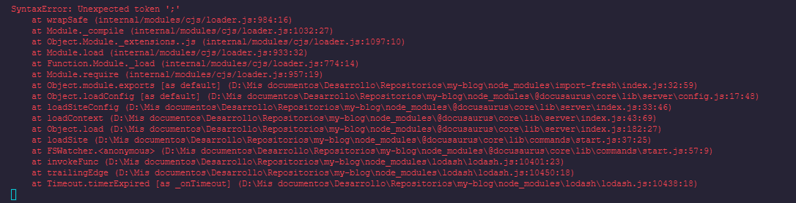

:::info Enlace de utilidad
[Call Stack - MDN](https://developer.mozilla.org/es/docs/Glossary/Call_stack)
:::

Es el lugar a donde van a parar todas las funciones que llamemos y las que estas mismas llamen, todo en un orden correspondiente. 
El motor de Javascript solamente cuenta con una sola pila de llamadas, por lo que no puede hacer varias cosas al mismo tiempo.

Por ejemplo, cuando desde un script llamamos a una función, el intérprete va a añadirla a la pila e iniciará su ejecución. 
Toda función que sea llamada desde esta, va a ser agregada por encima de ella en la pila y será ejecutada inmediatamente. 
Cuando se termine de ejecutar la última función llamada, se eliminará de la pila y reanudará  la ejecución de la función anterior.

:::tip Ayudita
Cada elemento en la pila de ejecución es distinto de otro, teniendo cada uno su propio contexto de ejecución y variables locales (Aunque sean varios elementos del mismo nombre).
:::

:::caution Atención
Nuestra pila por lo general tiene un límite de capacidad, por lo que si nos excedemos se producirá un error llamado **“desbordamiento de pila”** (Overflowing).
```js
function foo(){
  foo();
}
foo();
```
:::

Este ejemplo lo saqué de la documentación de MDN y nos dice básicamente esto: 

```js
function saludar(){
    dihola(){
        console.log('Hola');
    }
}
function diHola() {
    saludar();
}
//Invocación
saludar();
```

1. Se registra línea por línea nuestro script.
2. Una vez llega a la línea de cuando invocamos a la función ```saludar()```, el intérprete la agrega a la pila de llamadas.

**PILA DE LLAMADAS**
- ```saludar``` (Ejecutando)


3. Comienza la ejecución de cada línea de código que contenga dicha función hasta que se tope con una nueva llamada a otra función.
4. Llega a la invocación de ```diHola()```.
5. Añade la función ```diHola()``` a la pila de llamadas.

**PILA DE LLAMADAS**
- ```diHola``` (Ejecutando)
- ```saludar```

6. Ejecuta todas las líneas que contenga la función ```diHola()``` hasta el final. 
7. Una vez terminada la ejecución de ```diHola()``` esta es borrada de la pila.

**PILA DE LLAMADAS**
* ```saludar``` (Ejecutando)

8. Se vuelve a retomar la ejecución de la función ```saludar()``` desde el punto en que se quedó hasta el final. 
9. Una vez terminada la ejecución de ```saludar()``` se elimina de la pila.

**PILA DE LLAMADAS** 
- vacío

:::note Nota
**LIFO** Last In First Out: nos dice que, el último en entrar es el primero en salir.
:::


## Stack trace
En caso de que tengamos un error en el Call Stack, se nos informará mediante el Stack trace.



Este nos muestra la misma información que teníamos hasta ese momento en el Call Stack y como se fueron llamando cada función hasta la línea en que surgió el error. Se lee de abajo para arriba. 
